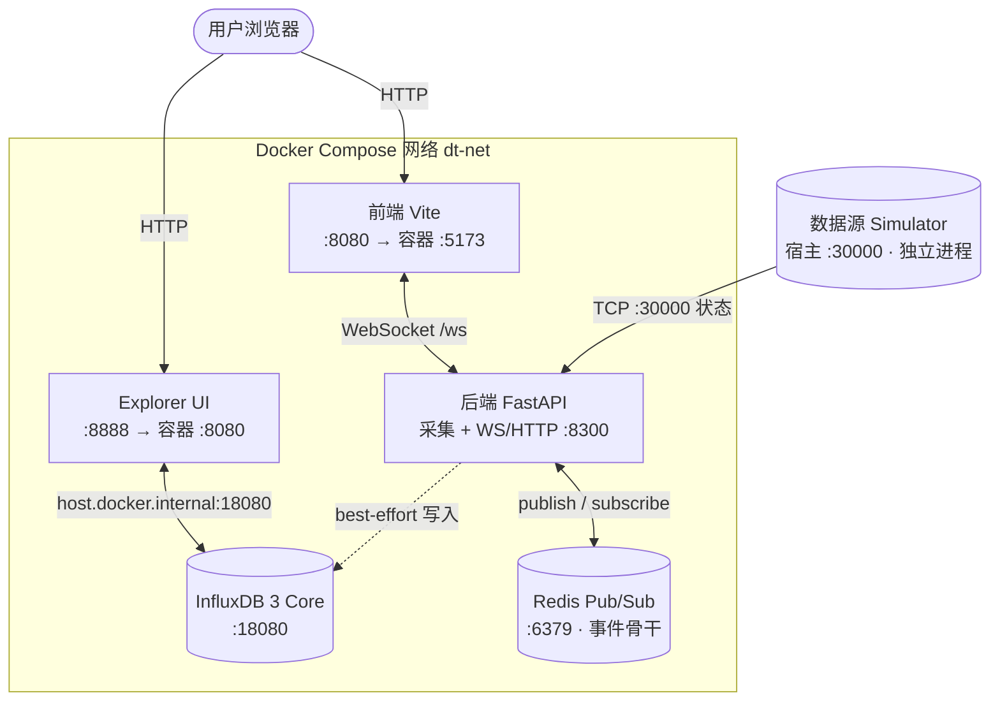

# Digital Twin 数字孪生系统 · 数据源中立 · 微服务架构


基于**可插拔数据源**的 3D 数字孪生系统：后端通过 TCP 接入数据源（默认随仓库的 Python 实时仿真器），经 Redis 消息总线转发，前端用 Three.js 实时渲染；时序数据可旁路存入 InfluxDB 3，用 InfluxDB3 Explorer 查看。

> 本仓库是**源码仓库**（前端 + 后端 + 连接器 + 文档）。运行所需组件用 Docker Compose 一键编排，无需在本机装 Python/Node。

## 特性

- **数据源中立**：后端只认 TCP 协议，仿真器 / MQTT / 任意连接器即插即用，后端零改动。
- **微服务部署**：`docker-compose` 编排 5 个独立服务（redis / influxdb3 / explorer / backend / frontend），Redis Pub/Sub 作事件总线解耦采集与展示。
- **实时孪生**：Three.js + WebSocket，状态 / 动作双通道动画；断线指数退避重连 + 心跳保活。
- **时序可溯**：InfluxDB 3 旁路存储，前端「场景绑定看板」把图表数据绑到具体孪生体。
- **健壮通信**：TCP keepalive 探死链、WS 可选鉴权、生产/消费解耦，单点故障不拖垮全链。

## 架构 · 微服务拓扑



**为什么这是微服务架构**：

- **可插拔数据源微服务**：`connectors/*` 是独立进程（TCP Server），可独立部署 / 重启 / 替换；后端只认协议，换数据源零改动。起多个连接器实例 → 汇入同一总线 → 前端统一可见，天然支持水平扩展。
- **事件骨干（Service Mesh）**：Redis Pub/Sub 是各服务间唯一契约，生产者（采集端）与消费者（WS 网关）互不感知，故障隔离、可独立伸缩。
- **独立可部署单元**：前端、后端、InfluxDB、Explorer 各自容器化，`docker-compose` 即编排层；任意服务可单独 `restart` 不影响其余。
- **解耦的单向实时环**：`数据源 → 后端采集 → Redis → 后端订阅 → WS → 前端`。后端可进一步拆为「采集服务（TCP→Redis）」+「网关服务（Redis→WS/HTTP）」两个微服务（见 `docs/architecture.md` 演进方向），使 Redis 成为两服务间唯一边界。

## 仓库内含 / 需自准备

| 随仓库发布（`git clone` 即得） | 需你本机/容器准备（不在仓库内） |
|------|------|
| `backend/`（FastAPI + Redis 总线）、`frontend/`（Three.js + Vite）、`connectors/`（可插拔数据源）、`docs/`、`docker-compose.yml`、`.env.example` | **Docker Desktop**（方式一必选）；Redis / InfluxDB 3（方式一由 compose 提供）；PlantSimulation 为可选分析外挂（商业软件，不随仓库） |

## 快速开始

### 方式一：Docker Compose 一键启动（推荐）

只需装 Docker（含 Compose 插件），后端/前端在各自容器内构建运行。

1. 复制环境变量模板并填写令牌：

   ```bash
   cp .env.example .env
   ```

   - **`INFLUXDB3_AUTH_TOKEN`（必填）**：管理员令牌，须带 `apiv3_` 前缀，例如 `apiv3_$(openssl rand -hex 16)`。它由 `influxdb3/entrypoint.sh` 经 `--admin-token-file` 预设为 InfluxDB 服务端 token，并同时注入 Explorer / 后端，**三方共用同一令牌**。
   - **`EXPLORER_SESSION_SECRET_KEY`（建议填）**：`openssl rand -hex 32`。

2. 一键启动：

   ```bash
   docker compose up -d
   ```

   | 组件 | 地址 |
   |------|------|
   | 前端 | http://localhost:8080 |
   | 后端 WS | ws://localhost:8300/ws |
   | InfluxDB 3 | http://localhost:18080 |
   | Explorer | http://localhost:8888 |

   ```bash
   docker compose ps                 # 查看状态
   docker compose logs -f backend    # 跟踪某服务日志
   docker compose restart frontend   # 单独重启某服务
   docker compose down               # 停止（加 -v 删 redis 数据卷）
   ```

> **换令牌**：改 `.env` 的 `INFLUXDB3_AUTH_TOKEN` 后，须清空 `./.docker/influxdb3-data` 内容再 `docker compose up -d influxdb3 explorer` 重建，否则报 `INVALID_TOKEN_CORE`。

### 方式二：原生命令行逐步启动（便于调试）

每个组件独立命令，无脚本依赖；需本机装 Redis、Python（建议 conda `DT` 环境）、Node.js。

```bash
# 1) Redis（必选）
docker run -d --name redis-twin --restart unless-stopped -p 6379:6379 redis:7-alpine

# 2) 后端（FastAPI，必选；默认 0.0.0.0:8300）
conda activate DT && cd backend && pip install -r requirements.txt && python -m src.main

# 3) 前端（Vite，必选）
cd frontend && npm install && npm run dev   # http://localhost:5173

# 4) 数据源仿真器（可选；默认 0.0.0.0:30000，后端自动连）
python -m connectors.sources.python_realtime
```

- **启用 InfluxDB 时序写入**（可选）：设环境变量 `INFLUXDB_ENABLED=true` 后再起后端；写库为 best-effort，失败仅记日志。
- **WS 可选鉴权**（默认关闭）：设 `WS_TOKEN=xxx` 后重启后端，前端需 `ws://localhost:8300/ws?token=xxx` 或 `Authorization: Bearer xxx` 连接，否则关闭（1008）。

## 数据源

默认数据源是随仓库的 **Python 实时仿真器**（`connectors/sources/python_realtime.py`，纯标准库），clone 即见 3D 动起来，不依赖任何商业软件。它作 TCP 服务端监听 `0.0.0.0:30000`，后端连上后持续推 `state`/`action` 信封。

```bash
python -m connectors.sources.python_realtime --dry-run   # 不联网，仅打印前几帧自检
python -m connectors.sources.python_realtime             # 默认 0.0.0.0:30000
```

| 参数 | 默认 | 说明 |
|------|------|------|
| `--host` / `--port` | `0.0.0.0:30000` | TCP 监听地址/端口 |
| `--hz` | `20` | `state` 推送频率（Hz） |
| `--dry-run` | 关闭 | 不联网，仅自检帧格式 |

**接入真实工业数据源（MQTT）**：`connectors/sources/mqtt_source.py` 订阅 MQTT broker，把符合平台协议的 `state`/`action` 信封经 TCP `:30000` 转发给后端——**后端零改动**，与仿真器并列。依赖 `pip install -r connectors/requirements.txt`（仅 paho-mqtt），运行示例：

```bash
python -m connectors.sources.mqtt_source --broker test.mosquitto.org --topic digital-twin/source
python -m connectors.examples.publish_demo --broker test.mosquitto.org --topic digital-twin/source
```

## 场景绑定看板（InfluxDB 历史）

后端把 `state`/`action` **旁路写入 InfluxDB 3**（best-effort）。前端工具栏「历史数据」打开侧边看板，数据**绑定到具体孪生体**（设备/零件来自 3D 场景，避免 id 漂移），对标中台「场景绑定报表」但零重依赖。

- **前置**：开启 `INFLUXDB_ENABLED=true`（默认 `false`，仅写库、不影响实时孪生流），且数据源在跑。
- **聚焦查询**：选设备 → 选零件 → 选字段（如 `temp`/`pos_x`）→ 选时间范围 → 刷新（或勾「自动」每 10s 拉取）。
- **📌 绑定选中设备**：在 3D 场景点选模型后点此按钮，自动把选中孪生体 id 填入设备下拉。
- **＋ 加入看板**：把当前选择快照成卡片，看板区可并排多张，每张独立拉取 + 独立 SVG 图。
- **后端接口**：`GET /api/history?device=&part=&field=&range=`（未启用返回 503，查询异常 502）。详见 `docs/api.md`。

## 端口总览

| 组件 | Docker 宿主端口 | 原生命令行端口 | 说明 |
|------|----------------|------|------|
| 前端 (Vite) | **8080**（容器 5173） | 5173 | Docker 用 8080 避 Windows 保留段 |
| 后端 (FastAPI) | 8300 | 8300 | HTTP 与 WebSocket 共用 |
| InfluxDB 3 Core | 18080 | 18080 | 绑定 `0.0.0.0` |
| InfluxDB3 Explorer | 8888 | 8888 | 映射 8888 → 容器 8080 |
| Redis | 6379 | 6379 | 消息总线（必选） |
| 数据源 Simulator | — | 30000 | 实时数据源 TCP（可选） |

## 排错

- **`INVALID_TOKEN_CORE`（HTTP 401）**：Explorer 发的 token 与 InfluxDB 接受的不一致。根因：`INFLUXDB3_AUTH_TOKEN` 环境变量只供 CLI 认证，`influxdb3 serve` 不会用它预设 token——本项目用 entrypoint 的 `--admin-token-file` 预设。改 `.env` 令牌后务必清空 `./.docker/influxdb3-data` 再重建 influxdb3。
- **Windows 端口被保留（`bind: access forbidden`）**：Docker/WSL2 会把 5173/3000/5000 等常用端口划为排除段（动态）。查：`netsh int ipv4 show excludedportrange protocol=tcp`；解决：改 `docker-compose.yml` 宿主端口（如 `"9000:5173"`）或 `frontend/vite.config.js` 的 `server.port`，比 `net stop winnat` 更稳。
- **Explorer 连不上 InfluxDB**：InfluxDB 须绑 `0.0.0.0:18080`（非 `127.0.0.1`）；Explorer 的 Server URL 须用 `host.docker.internal`（容器内 `localhost` 指向自己）；须挂可写 `db` 卷并设 `SESSION_SECRET_KEY`。

## 测试

后端单元测试覆盖 `data_processor` / `bus` / `websocket_handler` / `source_connector`（含双编码解析、消息总线契约、广播容错、重连退避）：

```bash
cd backend
pip install -r requirements.txt          # 含 pytest / pytest-asyncio
pytest                                    # 或 poetry/conda 环境直接 pytest
```

## 技术栈

- 仿真：PlantSimulation（SimTalk，可选分析外挂）
- 后端：Python + FastAPI + uvicorn + redis(asyncio) + websockets
- 消息总线：Redis Pub/Sub（传输无关抽象，支持后续切 MQTT；当前 `BUS_TYPE` 仅 `redis`）
- 时序存储：InfluxDB 3 Core（:18080）+ InfluxDB3 Explorer（:8888）
- 前端：Three.js + Vite
- 编排：Docker Compose

## 文档

- 接口：`docs/api.md` · 架构：`docs/architecture.md` · 部署：`docs/deployment.md`
